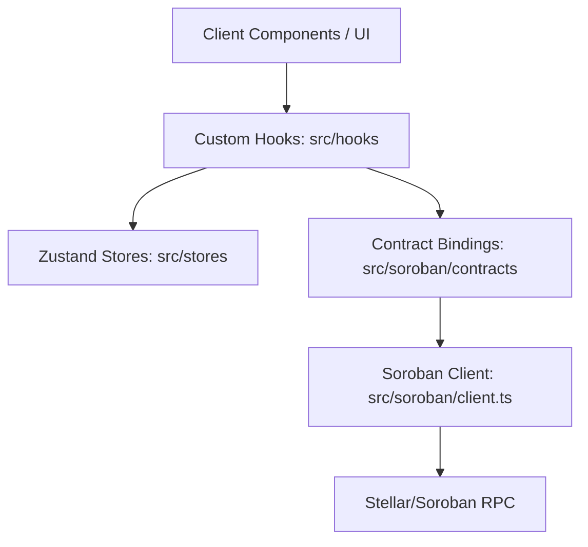

# TradeFlow Architecture Reference

Welcome to the TradeFlow Web codebase! This document serves as a guide for new contributors and maintainers. It outlines our directory structure, rendering paradigms, Web3 architecture, and guidelines for writing code in this repository.

---

## Codebase Overview

TradeFlow is built using **Next.js 14** (utilizing the App Router), **TypeScript**, **Tailwind CSS**, and integrates with the **Stellar/Soroban** smart contract ecosystem.

Here is the bird's-eye view of the directory structure under `/src`:

```text
src/
├── app/                  # Next.js App Router (Routing, layouts, and page definitions)
│   ├── api/              # API Route Handlers (Server-side endpoints)
│   ├── marketplace/      # Trade invoice marketplace pages
│   ├── swap/             # Token swap interfaces
│   │   └── page.tsx      # Swap page entry point
│   ├── globals.css       # Global styles and Tailwind directives
│   ├── layout.tsx        # Root layout wrapper
│   └── page.tsx          # Homepage
├── components/           # Modular, reusable UI components
│   ├── ui/               # Low-level presentational primitives (Button, Tooltip, etc.)
│   ├── layout/           # Shared layout components (Navbar, Sidebar)
│   ├── ConnectWallet.tsx # Feature-specific modular components
│   └── InvoiceMintForm.tsx
├── contexts/             # Specialized React contexts (e.g., Slippage, NetworkCongestion)
├── hooks/                # Custom hooks (e.g., wallet connection, Soroban events)
├── lib/                  # Shared utility functions and Stellar helper methods
│   ├── stellar.ts        # Lower-level Stellar SDK operations
│   └── format.ts         # Numeric and date formatting utils
├── providers/            # Application-wide global providers (e.g., QueryClientProvider)
├── soroban/              # Core Soroban integration layer
│   ├── contracts/        # TypeScript bindings for Soroban smart contracts
│   │   └── invoice.ts    # Invoice contract bindings
│   ├── client.ts         # Soroban RPC Server client instance manager
│   └── config.ts         # Network details (RPC URL, Passphrase, Contract IDs)
├── stores/               # Client-side state stores (Zustand state managers)
│   └── useWeb3Store.ts   # Global Web3 wallet and network state store
└── types/                # Project-wide TypeScript type definitions
```

---

## 1. Separation of Concerns: `app/` vs `components/`

To keep the codebase maintainable and scalable, we enforce a strict separation between routing/layouts and modular UI components.

### The `src/app/` Directory (Routing & Layouts)
* **Purpose**: Defines routes, page templates, layouts, and error boundaries.
* **Rule**: Files inside `src/app` should act primarily as **compositions** of UI components. Avoid writing complex form validation, raw layout styles, or massive component structures directly inside `page.tsx` or `layout.tsx`.
* **Conventions**:
  * `page.tsx`: Defines the unique UI for a route.
  * `layout.tsx`: Defines shared UI across multiple pages (e.g., sidebar and header).
  * `error.tsx` / `not-found.tsx`: Error boundaries and fallback pages.
  * `api/` / `route.ts`: Server-side API endpoints (Route Handlers).

### The `src/components/` Directory (Modular UI)
* **Purpose**: Holds all modular, reusable components.
* **Organization**:
  1. **`src/components/ui/`**: Low-level, stateless, presentational primitives. These are the bricks of our application (e.g., `Button.tsx`, `Slider.tsx`, `Tooltip.tsx`). They should not depend on global Web3 state or business logic.
  2. **`src/components/layout/`**: Components responsible for structural placement (e.g., `Navbar.tsx`, `Sidebar.tsx`).
  3. **`src/components/` (Root)**: Domain-specific or stateful UI blocks. These components combine UI primitives with state and business logic (e.g., `InvoiceMintForm.tsx`, `ConnectWallet.tsx`, `SwapInterface.tsx`).

---

## 2. Rendering Paradigms: Server vs. Client Components

Next.js 14 uses **React Server Components (RSC)** by default. Understanding when to use the `'use client'` directive is crucial for application performance, bundle size optimization, and SEO.

### When to Keep it as a Server Component (Default)
By default, keep components as Server Components. This keeps JS bundle sizes small and allows direct, secure server-side operations.
* **Use Case**: Static layouts, fetching initial metadata, pure presentation content, and structural wrappers.

### When to Add `'use client'`
Add the `'use client'` directive at the very top of your file when the component requires client-side interactivity or browser-specific APIs.
* **Use Case**:
  * Using React state or lifecycle hooks (`useState`, `useReducer`, `useEffect`, `useLayoutEffect`).
  * Using browser APIs (e.g., `window`, `localStorage`, Web3 extension wallets like Freighter).
  * Attaching event listeners (`onClick`, `onChange`, `onSubmit`).
  * Interacting with client-side contexts or hooks (e.g., wallet state, slippage settings).

### Code Comparison

#### 📝 Server Component Example (Default)
```tsx
// src/components/ui/Card.tsx
// No 'use client' is needed here. This runs entirely on the server.
import React from 'react';

interface CardProps {
  title: string;
  children: React.ReactNode;
}

export function Card({ title, children }: CardProps) {
  return (
    <div className="rounded-xl border border-gray-800 bg-gray-900/50 p-6 backdrop-blur-md">
      <h3 className="text-lg font-semibold text-white mb-2">{title}</h3>
      <div>{children}</div>
    </div>
  );
}
```

#### 📝 Client Component Example (`'use client'`)
```tsx
// src/components/AddTrustlineButton.tsx
'use client'; // Required for click handlers, state, and browser wallets

import { useState } from 'react';
import { Button } from './ui/Button';

export function AddTrustlineButton({ assetCode }: { assetCode: string }) {
  const [isPending, setIsPending] = useState(false);

  const handleAddTrustline = async () => {
    setIsPending(true);
    try {
      // Browser wallet/Freighter interaction here...
      console.log(`Adding trustline for ${assetCode}...`);
    } catch (error) {
      console.error(error);
    } finally {
      setIsPending(false);
    }
  };

  return (
    <Button onClick={handleAddTrustline} disabled={isPending}>
      {isPending ? 'Adding...' : `Add ${assetCode} Trustline`}
    </Button>
  );
}
```

---

## 3. Web3 & Soroban Integration Architecture

TradeFlow integrates with the Stellar network and Soroban smart contracts. The interaction layer is structured as follows:



### 1. Smart Contract Bindings (`src/soroban/contracts/`)
TypeScript wrappers representing Soroban smart contracts (e.g., `invoice.ts`). These bindings:
* Map contract methods to strongly typed TypeScript functions.
* Serialize JavaScript arguments into XDR format.
* Deserialize contract return values back into typed JavaScript structures.

### 2. Client & Config (`src/soroban/`)
* **`config.ts`**: Resolves network-specific configurations (like Testnet or Mainnet RPC endpoints, passphrases, and contract IDs) by reading active network contexts and environment variables.
* **`client.ts`**: Manages a cached, single instance of the Soroban `Server` client (`getSorobanClient()`). It handles cache clearing automatically when switching networks (e.g., Testnet to Futurenet).

### 3. Global State Providers & Stores
We manage decentralized application state through a mix of React Contexts and global Zustand stores:
* **`src/providers/`**: Holds high-level providers that wrap the app layout tree, such as `QueryClientProvider` (for React Query caching).
* **`src/contexts/`**: Contains specialized providers for targeted slices of configuration/state (e.g., `SlippageContext`, `ExpertModeContext`, `NetworkCongestionContext`).
* **`src/stores/`**: Holds Zustand state managers for high-performance reactive state. For example:
  * `useWeb3Store.ts` stores user wallet connection state, selected Stellar network details, and active account public keys.

### 4. Custom Hooks (`src/hooks/`)
Hooks bridge UI components with contract actions. They abstract asynchronous states, event handlers, and feedback mechanisms.
* `useWalletConnection.ts`: Manages connecting/disconnecting via Freighter, loading balances, and handling browser extension events.
* `useSorobanEvents.ts`: Listens to RPC event streams for contract emission events.
* `useTxWithToast.ts`: Executes a transaction and automatically triggers success/error notifications (toasts).

---

## Guidelines for Contributors

1. **Keep Presentational Components Clean**: Do not import `useWeb3Store` or `getSorobanClient` into `/components/ui/` elements. Keep them strictly layout and style-oriented.
2. **Handle Loading and Error States**: Always provide skeleton loader fallbacks (`SkeletonRow`, `TableSkeleton`) and leverage custom error boundaries.
3. **Verify Network Compatibility**: Before executing a transaction, use the `TransactionGuard` component or `useNetworkDetection` hook to check if the user is connected to the matching Stellar network.
4. **Follow Linting Rules**: Run `npm run lint` and verify tests pass with `npm run test` before submitting your Pull Request.
